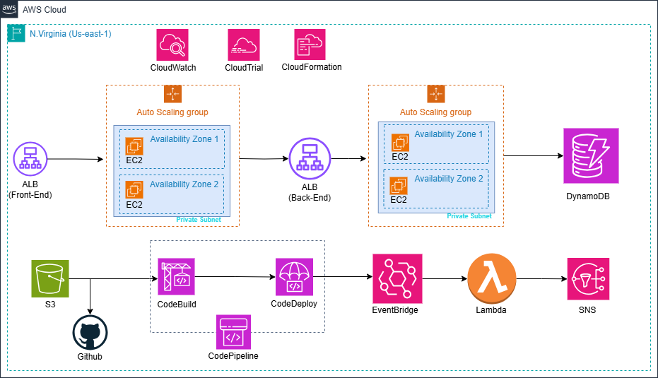

# Library Management System - AWS Cloud Infrastructure

## Overview
A scalable, secure, and highly available library management system deployed on AWS cloud infrastructure. The system features a modern web frontend, robust backend services, and automated CI/CD pipeline.

## Architecture


### Key Components
- **Frontend**: React-based web application
- **Backend**: Node.js REST API
- **Database**: DynamoDB
- **CI/CD**: Full automation with AWS Developer Tools

### AWS Services Used
- Amazon EC2 with Auto Scaling Groups
- Application Load Balancer
- Amazon DynamoDB
- AWS CodePipeline
- AWS CodeBuild
- AWS CodeDeploy
- Amazon EventBridge
- AWS Lambda
- Amazon SNS
- Amazon CloudWatch
- Amazon CloudTrail
- AWS CloudFormation

## Features
- 🔄 High Availability through Multi-AZ deployment
- 📈 Auto-scaling capabilities
- 🔒 Secure infrastructure with private subnets
- 🚀 Automated CI/CD pipeline
- 📊 Comprehensive monitoring and logging
- 📱 Responsive web interface

## Prerequisites
- AWS Account with appropriate permissions
- GitHub account
- Node.js and npm installed locally
- AWS CLI configured

## Local Development Setup
1. Clone the repository:
```bash
git https://github.com/Sheshanadaf/aws-library-sys.git
```

2. Install dependencies:
```bash
# Frontend
cd my-project
npm install

# Backend
cd ../backend
npm install
```

3. Set up environment variables:
```bash
cp .env.example .env
# Update .env with your configurations
```

## Deployment
The system uses AWS CloudFormation for infrastructure deployment:

1. Deploy the CloudFormation stack:
```bash
aws cloudformation create-stack \
  --stack-name library-system \
  --template-body file://template.yaml \
  --capabilities CAPABILITY_NAMED_IAM
```

2. Configure GitHub repository with AWS CodeStar connection

3. Push changes to trigger the CI/CD pipeline:
```bash
git add .
git commit -m "Your changes"
git push origin main
```

## Infrastructure Details

### Frontend (EC2 + Auto Scaling)
- Minimum 2 instances across availability zones
- t2.micro instance type
- Auto scaling based on CPU utilization

### Backend (EC2 + Auto Scaling)
- Minimum 2 instances across availability zones
- t2.micro instance type
- Health check endpoint at `/health`

### Database
- DynamoDB with on-demand capacity
- Auto-scaling enabled
- Point-in-time recovery available

## Monitoring and Alerts
- CloudWatch metrics for system health
- SNS notifications for deployment status
- CloudTrail for API and resource monitoring

## Security Measures
- Private subnets for compute resources
- Security group isolation
- IAM roles with least privilege
- HTTPS enabled for all endpoints

## Contributing
1. Fork the repository
2. Create your feature branch (`git checkout -b feature/AmazingFeature`)
3. Commit your changes (`git commit -m 'Add some AmazingFeature'`)
4. Push to the branch (`git push origin feature/AmazingFeature`)
5. Open a Pull Request
